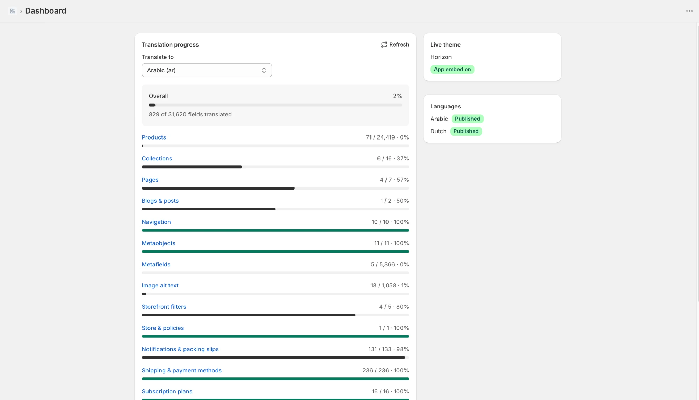

# Translating your store

Open a section from the app menu (**Products**, **Collections**, **Pages**, **Blog posts**, **Navigation** or **Other content**), pick the language at the top, open an item and fill in the translations next to the original text. Click **Save** to publish them. Translations are saved in Shopify and show on your storefront right away.

## Tracking progress

The **Dashboard** shows how much of each content type is translated for every language, whether the app embed is on in your live theme, and which languages are published. Click a content type to start translating it.

* **Products:** title, description, SEO, URL handle, options and option values, vendor, tags, metafields and images.
* **Navigation:** menu titles and every menu item, including sub-items.
* **Other content:** blogs, metaobjects, image alt text, storefront filters, store name and SEO, policies, notifications, shipping and payment method names, and subscription plans.

!!! info

    A field marked **outdated** means the original text changed after it was translated. Check the translation and save it again.
